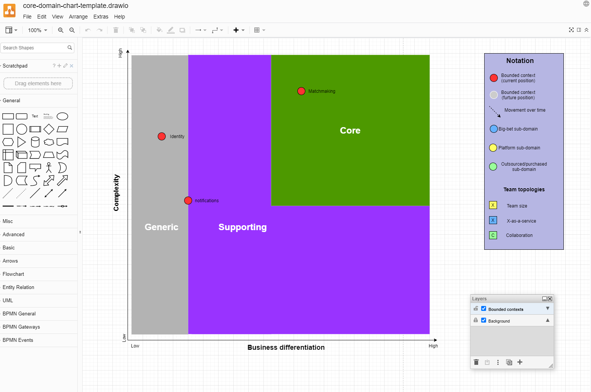

# Core Domain Chart drawio template how to

## Basic draw.io Usage

- Checkout this repository
- Head over to [draw.io](https://www.diagrams.net/) or install the drawio desktop app
- Click "Open Existing Diagram"
- Select the `core-domain-chart-template.drawio` template
- Make sure to have the "Bounded contexts" layer activated and unlocked
- Copy icons from the "Notation" box and place them in the Core Domain Chart as needed

